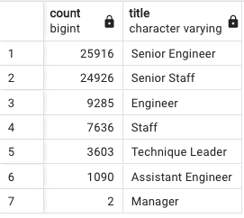
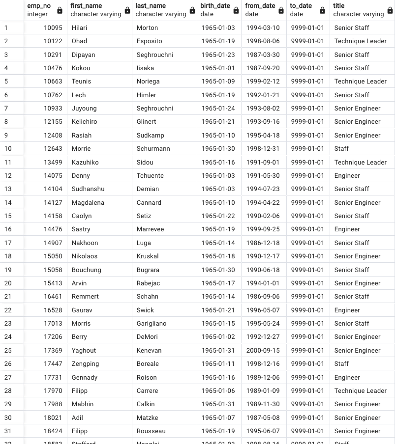
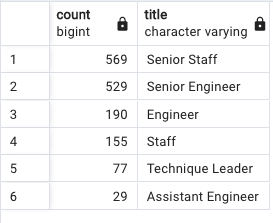
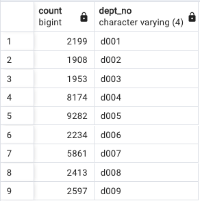
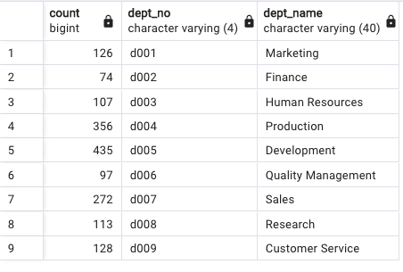

# Pewlett-Hackard-Analysis

## Overview of the analysis: 

### Purpose of this analysis - 
To determine the number of retiring employees per title, and identify employees who are eligible to participate in a mentorship program. As a deliverable, the report summarizes the analysis and helps prepare manager for the “silver tsunami” as many current employees reach retirement age.

Deliverables include the following:

Deliverable 1: The Number of Retiring Employees by Title
Deliverable 2: The Employees Eligible for the Mentorship Program
Deliverable 3: A written report on the employee database analysis (README.md)

## Results: 

Table 1. Number of Retiring Employees by Title

Table 2. Employees Eligible for the Mentorship Program

#### Provide a bulleted list with four major points from the two analysis deliverables. 

1. There are a significant number of employees within the age range for retirement. The majority of those retiring are Senior Engineers, followed by Senior Staff. 

2. The Development Department has the largest proportion total possible retirees. This is followed by production. It will be important for leadership to give these department special attention. 

3. On average, if there is a one to one mentorship program, only approximately 5% would be mentored by outgoing employees by department. Please see Tables 4 and 5. It may benefit the company to examine expanding the parameters for mentorship eligibility. 

4. On average, if there is a one to one mentorship program, only approximately 2% would be mentored by outgoing employees by title. Please see Tables 1 and 3. It may benefit the company to examine expanding the parameters for mentorship and reexamineg options for those retiring. 

## Summary: 

Provide high-level responses to the following questions, then provide two additional queries or tables that may provide more insight into the upcoming "silver tsunami."

a. How many roles will need to be filled as the "silver tsunami" begins to make an impact?

Additional analysis should examine what positions in what departments have the greatest chance of causing Pewlett-Hackard to be under-resourced. The number of eligible employees for mentorship is too small to insure coverage. The number of employees eligible for retirement may cause the company to be unable to maintain effectiveness. 

Table 3. The Number of Mentorship Eligible Employees by Title

c. Are there enough qualified, retirement-ready employees in the departments to mentor the next generation of Pewlett-Hackard employees?

As stated above, average, if there is a one to one mentorship program, only approximately 5% would be mentored by outgoing employees by department and should consider expanding the mentorship program to include students that are entry level (e.g., more recent birthdate).

Table 4. The Number of Retiring Employees by Dept No. 

Table 5. The Number of Eligible Mentees by Dept No and Name

